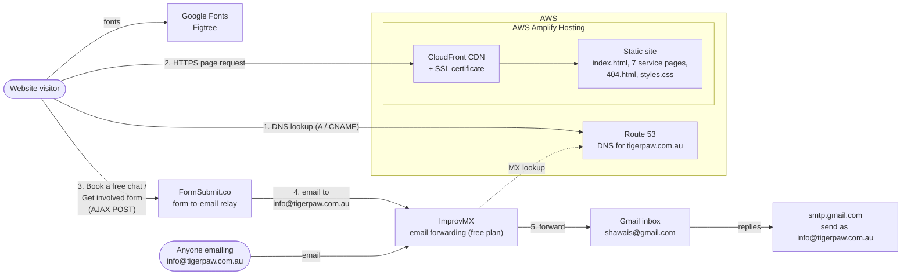

# TigerPaw website architecture (current state)

Static website hosted on AWS Amplify. There's no backend of our own: form enquiries go through FormSubmit and are forwarded by ImprovMX into Gmail.

## Components

| Component | Role | Where it's configured |
|---|---|---|
| Route 53 | DNS for tigerpaw.com.au: website records (A, `www` CNAME) point to Amplify/CloudFront; MX records point to ImprovMX; TXT (SPF) record authorises ImprovMX and Gmail to send for the domain | AWS Console > Route 53 > Hosted zones |
| AWS Amplify Hosting | Serves the static site through CloudFront with SSL. Deployed manually by uploading a zip ("Deploy without Git") | AWS Console > Amplify |
| Static site | Plain HTML/CSS, no build step. The contact form and its script are in `index.html` | This repo |
| Google Fonts | Loads the Figtree font | `<link>` in each page's `<head>` |
| FormSubmit.co | Receives the form POST and emails it to info@tigerpaw.com.au. One-time activation per receiving address | `action` of `#contact-form` in `index.html` |
| ImprovMX | Receives mail for tigerpaw.com.au and forwards `info@` to Gmail. Free plan: 25 aliases, 500 forwards/day, no outgoing SMTP | improvmx.com dashboard |
| Gmail | Where enquiries are read. Replies go out as info@tigerpaw.com.au via Gmail's "Send mail as" (smtp.gmail.com + App Password) | Gmail > Settings > Accounts and Import |

## Form flow

1. A visitor clicks **Book a free chat**, or **Get involved** on a project card. Get involved fills a hidden `project` field and sets the email subject to `Get involved: <project>`.
2. The script in `index.html` posts the form to `https://formsubmit.co/ajax/info@tigerpaw.com.au` and shows a success or error message in the page.
3. FormSubmit emails the enquiry, formatted as a table, to info@tigerpaw.com.au.
4. The MX records send that mail to ImprovMX, which forwards it to shawais@gmail.com.

## Deploying changes

Edit files, zip them (files at the root of the zip), and upload a new deployment in Amplify. See `README.md`.
